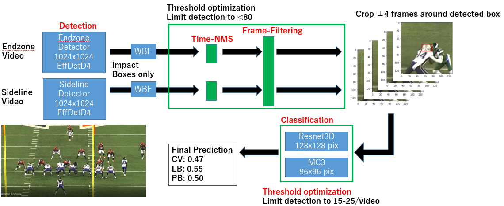
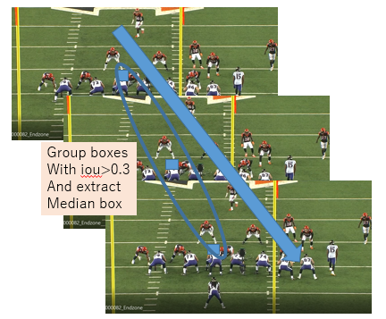

# Overview


This solution employs a two-stage pipeline: the first stage identifies candidate impact boxes, while the second stage determines whether these candidate boxes are true or false positives.

## Detectors

Separate detectors were trained for Endzone and Sideline videos. Through experimentation, training individual detectors for each type of video provided better cross-validation results.

### Post-Processing of Detections



A significant challenge was filtering out impact boxes that did not correspond to actual moments of impact. To address this, a time-based NMS (Non-Maximum Suppression) was applied. Boxes with an IoU greater than 0.3 within a 30-frame window were grouped, and only the median box—representing the time of impact—was retained. Additional filtering was applied to exclude boxes that were not present in both Endzone and Sideline videos within a specific time frame.

The first stage of the pipeline achieved Precision: 0.2, Recall: 0.6, and F1 Score: 0.2. Parameters were adjusted to prioritize high recall during detection.

## Classification

Following an approach similar to the 3rd place team's solution, the model crops ±4 frames of helmet images around each candidate box and uses a ResNet3D model for classification. This was implemented using the video classification model from torchvision. To improve performance, the ensemble included eight classifiers with horizontal-flip Test Time Augmentation (TTA). Both Endzone and Sideline videos were used for training the classifiers.

### Threshold Optimization

Given that the number of impacts per video typically ranged from 10 to 20, the prediction threshold was adaptively adjusted to produce 15–25 predictions per video. This strategy made the model more robust against threshold tuning, which was critical since a single video with excessive false positives could drastically affect the overall score.

## Training the Detector

Training the detector was particularly challenging due to the wide range of options available. Mixup and CutMix augmentations were applied, and images with impacts were oversampled during training. Non-impact images were also included, which improved the detectors' precision.

## Training the Classifier

Inspired by the Deepfake 3rd place solution, 3D CNNs were used for the classifiers. All helmet images were cropped and resized to 96x96 or 128x128 pixels for training. To handle the abundance of false images, focal loss was used as the loss function. Mixup augmentations further improved cross-validation performance.

Due to time constraints, both the detector and classifier were trained as single-fold models.

## Prerequisite


1. Write out training images with `train-prepare-labels.ipynb`
2. Write out classification images with `prepare_classification_images.ipynb`
3. Place `effdet` pretrained models inside `pretrain` folder.

### Training

for end model:

```console
python train_1ststage.py --enum 15 --modeltype Endzone --cutmix --strech 3 --imsize 1024 --bs 3 --all --effdet effdet4 --lr 1e-4
```

for side model:
```console
python train_1ststage.py --enum 15 --modeltype Sideline --cutmix --strech 3 --imsize 1024 --bs 3 --all --effdet effdet4 --lr 1e-4
```


### Inference

Get inference results with `1st-stage-Inference.ipynb`

CLassify with `2nd-stage-Inference.ipynb`